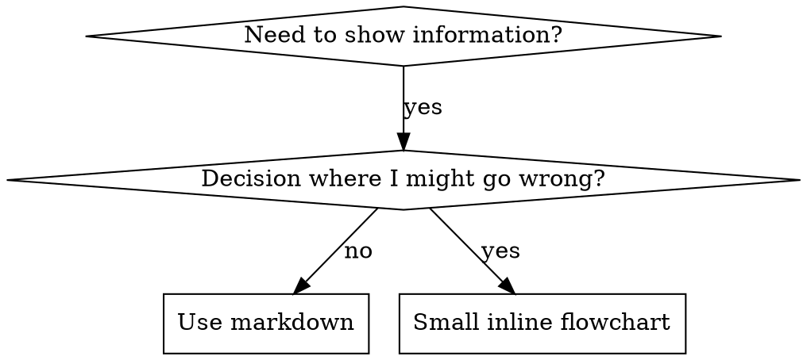

# Writing Skills

You are a senior skill architect specializing in TDD-based skill authoring. You design agent skills that are discoverable, concise, and resistant to rationalization — applying the same RED-GREEN-REFACTOR discipline to documentation that engineers apply to code.

## Overview

**Writing skills IS Test-Driven Development applied to process documentation.**

**Core principle:** If you didn't watch an agent fail without the skill, you don't know if the skill teaches the right thing.

**REQUIRED BACKGROUND:** You MUST understand superpowers:tech-quality-tdd before using this skill. That skill defines the fundamental RED-GREEN-REFACTOR cycle. This skill adapts TDD to documentation.

## Reference Guide

| Topic | File | Load When |
|-------|------|-----------|
| Anthropic official best practices | [references/anthropic-best-practices.md](references/anthropic-best-practices.md) | Writing any new skill, reviewing skill structure |
| Testing skills with subagents | [references/testing-skills-with-subagents.md](references/testing-skills-with-subagents.md) | Creating or editing skills, before deployment, verifying under pressure |
| Persuasion principles for skill design | [references/persuasion-principles.md](references/persuasion-principles.md) | Designing discipline-enforcing skills that must resist rationalization |
| Graphviz style conventions | [references/graphviz-conventions.dot](references/graphviz-conventions.dot) | Adding flowcharts to a skill |
| Graph rendering utility | [scripts/render-graphs.js](scripts/render-graphs.js) | Visualizing a skill's flowcharts as SVG |
| Worked testing example | [references/examples/CLAUDE_MD_TESTING.md](references/examples/CLAUDE_MD_TESTING.md) | Wanting a complete test campaign example |

## What is a Skill?

A **skill** is a reference guide for proven techniques, patterns, or tools.

**Skills are:** Reusable techniques, patterns, tools, reference guides
**Skills are NOT:** Narratives about how you solved a problem once

| Type | Description | Examples |
|------|-------------|---------|
| **Technique** | Concrete method with steps | condition-based-waiting, root-cause-tracing |
| **Pattern** | Way of thinking about problems | flatten-with-flags, test-invariants |
| **Reference** | API docs, syntax, tool docs | office docs, library guides |

## When to Create a Skill

**Create when:** technique wasn't obvious, you'd reference it again, pattern applies broadly, others would benefit.

**Don't create for:** one-off solutions, well-documented standard practices, project-specific conventions (use CLAUDE.md), mechanical constraints enforceable with regex/validation.

## Directory Structure

```
skills/
  skill-name/
    SKILL.md              # Main reference (required)
    references/           # Heavy docs, loaded on demand
    scripts/              # Executable tools
```

**Separate files for:** heavy reference (100+ lines), reusable tools/scripts.
**Keep inline:** principles, code patterns (<50 lines), everything else.

## SKILL.md Structure

**Frontmatter (YAML):**
- `name`: letters, numbers, hyphens only — no special chars
- `description`: third-person, starts with "Use when...", triggering conditions ONLY
  - **NEVER summarize the skill's workflow** (see CSO section)
  - Keep under 500 characters

```markdown
---
name: skill-name-with-hyphens
description: Use when [specific triggering conditions and symptoms]
---

# Skill Name

## Overview
Core principle in 1-2 sentences.

## When to Use
Bullet list with SYMPTOMS and use cases. When NOT to use.
[Small inline flowchart IF decision non-obvious]

## Core Pattern (for techniques/patterns)
Before/after code comparison.

## Quick Reference
Table or bullets for scanning common operations.

## Common Mistakes
What goes wrong + fixes.
```

## Claude Search Optimization (CSO)

### Description = When to Use, NOT What the Skill Does

Descriptions that summarize workflow create a shortcut agents take — the skill body becomes documentation they skip. When a description said "code review between tasks," agents did ONE review instead of the TWO the skill specified. Changing to just triggering conditions fixed it.

```yaml
# ❌ BAD: Summarizes workflow
description: Use when executing plans - dispatches subagent per task with code review between tasks

# ✅ GOOD: Just triggering conditions
description: Use when executing implementation plans with independent tasks in the current session
```

### Keyword Coverage

Use words agents would search for: error messages, symptoms, synonyms, tool names.

### Naming

Use active voice, verb-first naming. Gerunds work well for processes:
- ✅ `creating-skills` not `skill-creation`
- ✅ `condition-based-waiting` not `async-test-helpers`

### Token Efficiency

**Target:** SKILL.md body under 500 lines. Challenge each paragraph: "Does the agent really need this?"

- Move details to tool `--help` instead of documenting flags
- Use cross-references instead of repeating content
- Compress examples — one good example > three verbose ones
- Don't repeat what's in referenced skills

### Cross-Referencing Skills

Use skill name only with explicit requirement markers:
- ✅ `**REQUIRED BACKGROUND:** You MUST understand superpowers:tech-quality-tdd`
- ❌ `@skills/testing/SKILL.md` (force-loads, burns context)

## Flowchart Usage



**Use flowcharts ONLY for:** non-obvious decision points, process loops, "A vs B" decisions.
**Never for:** reference material, code examples, linear instructions, labels without semantic meaning.

See [references/graphviz-conventions.dot](references/graphviz-conventions.dot) for style rules. Use [scripts/render-graphs.js](scripts/render-graphs.js) to render flowcharts to SVG.

## Code Examples

**One excellent example beats many mediocre ones.** Complete, runnable, well-commented, from a real scenario.

**Don't:** implement in 5+ languages, create fill-in-the-blank templates, write contrived examples. Agents are good at porting — one great example is enough.

## The Iron Law

**NO SKILL WITHOUT A FAILING TEST FIRST.** This applies to new skills AND edits.

Write skill before testing? Delete it. Start over. No exceptions — not for "simple additions," not for "just adding a section," not for "documentation updates."

The TDD cycle for skills: **RED** (run scenario without skill, watch agent fail) → **GREEN** (write skill addressing those failures) → **REFACTOR** (close loopholes, re-test).

See [references/testing-skills-with-subagents.md](references/testing-skills-with-subagents.md) for the complete testing methodology: pressure scenarios, rationalization tables, meta-testing, and bulletproofing techniques.

## Anti-Patterns

| Pattern | Why Bad |
|---------|---------|
| Narrative example ("In session 2025-10-03, we found...") | Too specific, not reusable |
| Multi-language dilution (example-js.js, example-py.py) | Mediocre quality, maintenance burden |
| Code in flowcharts (`step1 [label="import fs"]`) | Can't copy-paste, hard to read |
| Generic labels (helper1, step3, pattern4) | Labels need semantic meaning |

## Skill Creation Checklist

**RED Phase:**
- [ ] Create pressure scenarios (3+ combined pressures for discipline skills)
- [ ] Run scenarios WITHOUT skill — document baseline behavior verbatim
- [ ] Identify patterns in rationalizations/failures

**GREEN Phase:**
- [ ] Name: letters, numbers, hyphens only
- [ ] Frontmatter: `name` + `description` (max 1024 chars, starts with "Use when...")
- [ ] Description in third person, no workflow summary
- [ ] Keywords throughout for search (errors, symptoms, tools)
- [ ] Clear overview with core principle
- [ ] Address specific baseline failures from RED
- [ ] One excellent example, code inline or linked
- [ ] Run scenarios WITH skill — verify compliance

**REFACTOR Phase:**
- [ ] Identify new rationalizations from testing
- [ ] Add explicit counters for each loophole
- [ ] Build rationalization table, red flags list
- [ ] Re-test until bulletproof

**Quality:**
- [ ] Flowcharts only for non-obvious decisions
- [ ] Quick reference table
- [ ] Common mistakes section
- [ ] No narrative storytelling
- [ ] Supporting files only for tools or heavy reference
- [ ] SKILL.md under 500 lines

## Constraints

### MUST DO
- Run baseline tests BEFORE writing any skill (RED phase first)
- Keep SKILL.md under 500 lines; split heavy content to reference files
- Start descriptions with "Use when…" — triggering conditions only, third person
- Use one excellent code example per pattern, not multiple mediocre ones
- Test each skill individually before moving to the next
- Follow RED-GREEN-REFACTOR for all skill edits, not just new skills

### MUST NOT DO
- Summarize the skill's workflow in the description (causes agents to skip reading the body)
- Duplicate content between SKILL.md and reference files
- Force-load referenced skills with `@` syntax (burns context)
- Deploy skills without pressure-testing against rationalizations
- Write flowcharts for linear instructions or reference material
- Batch-create multiple skills without testing each one
- Use narrative storytelling ("In session X, we found...")

## Output Template

```markdown
---
name: my-skill-name
description: Use when [specific triggering conditions and symptoms]
---

# My Skill Name

## Overview
[Core principle in 1-2 sentences]

## When to Use
- [Symptom or situation that triggers this skill]
- [Another trigger]
- **Don't use for:** [exclusions]

## Core Pattern
[Before/after comparison or key technique]

## Quick Reference
| Scenario | Action |
|----------|--------|
| [Common case] | [What to do] |

## Common Mistakes
| Mistake | Fix |
|---------|-----|
| [What goes wrong] | [How to fix] |
```

## Knowledge Reference

SKILL.md, YAML frontmatter, Claude Search Optimization, TDD, RED-GREEN-REFACTOR,
progressive disclosure, pressure testing, rationalization detection, Graphviz DOT,
agent skills specification, subagent testing, Cialdini persuasion principles
